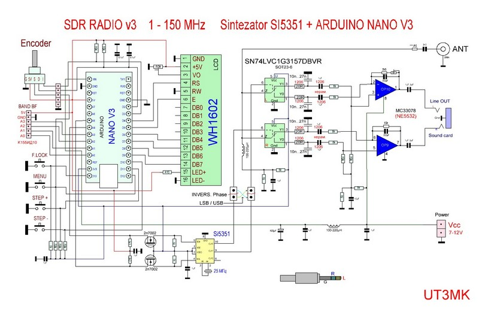
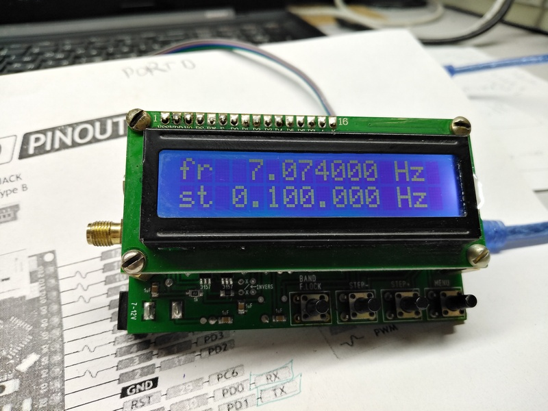
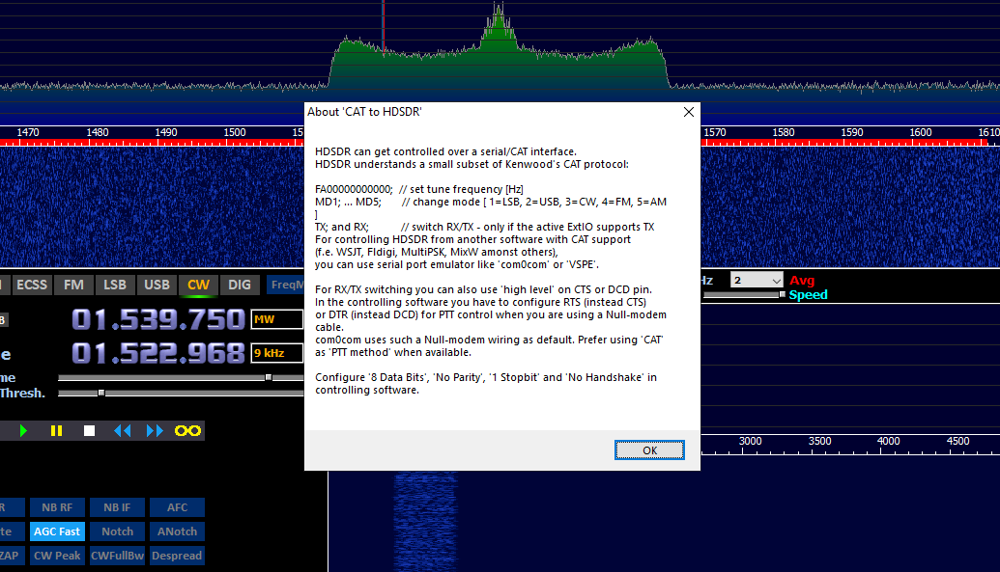
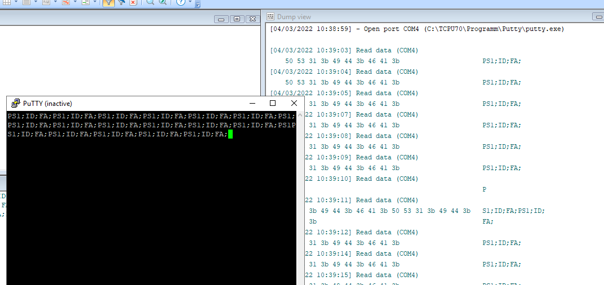
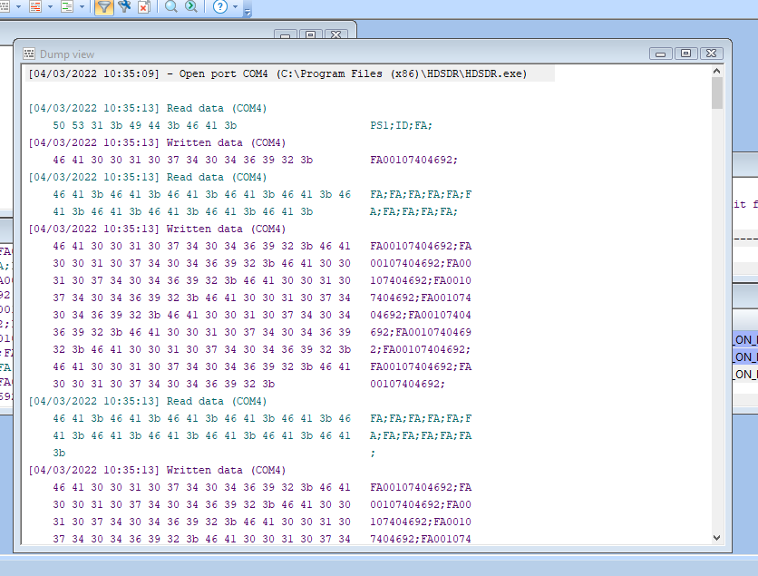
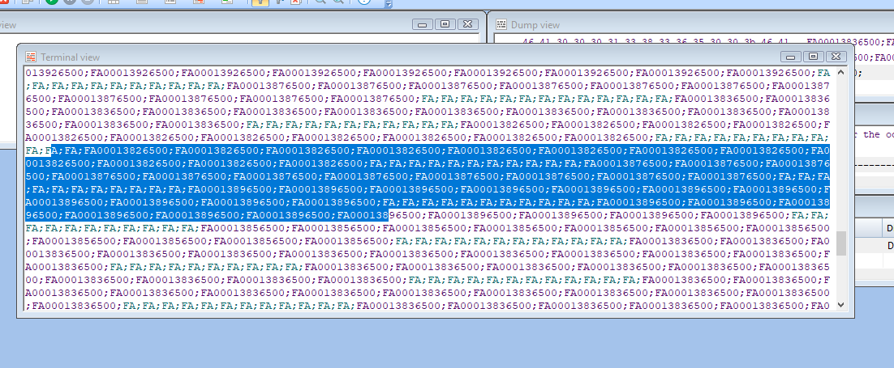

<h1>Arduino, SDR Radio</h1>
    <h3>Источники</h3>
    <ol>
        <li> Форум автора UT3MK <a href="https://ut3mk.at.ua/forum/2-157-1">с обсуждением</a> </li>
        <li>USDX трансивер с открытым исходным кодом <a href="https://github.com/threeme3/usdx">GitHub</a> Использовал наработки для генератора смещения фазы на 90 градусов. CAT-протокол</li>
        <li>Описание протокола CAT <a href="https://www.kenwood.com/i/products/info/amateur/ts_480/pdf/ts_480_pc.pdf">Нормальное описание каждой команды</a></li>
        <li>Библиотеки для работы с кнопками и енкодером использовал от его <a href="https://github.com/GyverLibs">Arduino библиотеки от AlexGyver</a></li> 
    </ol>
    <h3>Описание работы</h3>
    
SDR приёмник прямого преобразования с нулевой промежуточной частотой. После смесителя сигнал I-Q усиливанется, дальше его необходимо подать на линейный вход компьютера(работает и вход микрофона)

    
Схему печатной платы  использовал радиолюбителя UT3MK. У него полное описание, принцип работы и авторская реализация[1]

    
    
Схема приёмника. Источник[1]

    
    
Внешний вид, готового приёмника

    
Причина написать свой скетч?! При использовании прошивки автора[1] появляется 10кГц смещение частоты генератора и невозможно исправить корректировкой. Может быть есть другая прошивка?!

    
Использовал программу для прослушивания HDSDR. CAT протокол от FT- трансиверов

    
    
Описание в самой программе. Этого достаточно для работы. Подробное описание команд в источнике[3].

    
Как работает скетч автора? При работе без подключения CAT, постоянно посылается посылка.

    
    
Описание команд[3]. ;- разделитель команда, PS1; - устройство включено,  ID; - пустой идентификатор(у FT-480 ID020; ) , FA; - команда без 11 цифр, ответить какая установлена частота   

    
При ответе программой HDSDR, приёмник посылает 10 команд FA;, в ответ получает ответ 10 раз FAXXXXXXXXXXX; где X- цифра от 0-9. В момент изменения частоты пользователем меняется частота и генератор изменяет частоту. И так повторяется до момента отключения от CAT

    
    
Изменение частоты передачи

    
    <h3>Своя реализация прошивки</h3>
    
 У автора скорость САТ 57600. у меня в скетче можете поменять на удобную для вас. строка   Serial.begin(9600); 

    
Сохранил функционал блокировки экрана, показывает на LCD экране * при однократном нажатии кнопки.

    
Переделал управление по CAT протоколу. теперь энкодер на устройстве, управляет частотой, которая устанавливается в программе HDSDR. И если нужно изменить частоту, то в программе мышкой переместить на нужную, при этом генератор не поменяет частоту.

    
Описание кода в скетче.

    <h3>P.S. Ошибки, недочёты</h3>
    
Нет корректировки частоты микросхемы Si5351, но она там и не нужна). При работе без CAT, напрямую со звуковой карты, можете установить любую частоту. Водопад в качестве панорамы.

    
Нет сохранения последних настоек, каждое включение сбрасывает настройки.

    <h3>Лицензия</h3>
    
Используйте как хотите.
